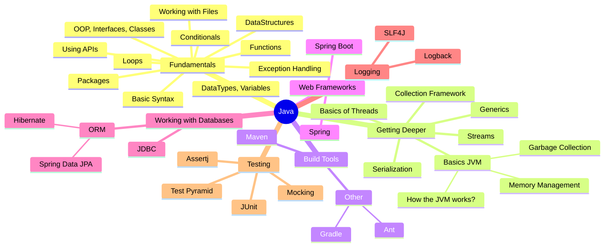

# java-roadmap
Should help people learn the right things to be successful as a junior java dev

inspired by https://roadmap.sh/java

```mermaid
mindmap
  root((Java))
    Fundamentals
      Basic Syntax
      DataTypes, Variables
      Conditionals
      Functions
      Loops
      Exception Handling
      DataStructures
      OOP, Interfaces, Classes
      Packages
      Working with Files
      Using APIs
    Getting Deeper
      Basics JVM
        How the JVM works?
        Garbage Collection
        Memory Management
      Collection Framework
      Serialization
      Generics
      Streams
      Basics of Threads
    Build Tools
      Maven
      Other
        Gradle
        Ant
    Web Frameworks
      Spring
      Spring Boot
    Working with Databases
      ORM
        Spring Data JPA
        Hibernate
      JDBC
    Logging
      SLF4J
      Logback
    Testing
      Test Pyramid
      JUnit
      Assertj
      Mocking

```
